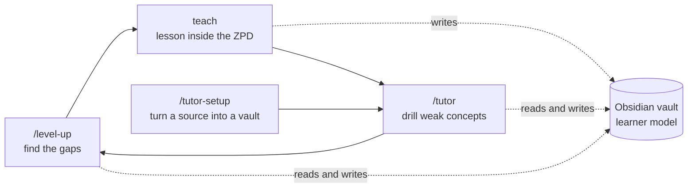

# zpd-learning

Claude Code skills that teach you things so they stick, and keep track of what you know in an
Obsidian vault.

You ask Claude to explain something. Before it explains, it asks you questions to find out where
your knowledge runs out, and it starts teaching from that point. Every answer you give is saved
to your vault. Later sessions read those notes, quiz you on what you got wrong, and check again
to see whether the gap has closed.

## The approach

> **Teaching inside the learner's zone of proximal development, found by adaptive testing and
> tracked in a learner model.**

That sentence uses three terms from learning science. Each one maps to a specific part of this
repo:

| Term | What it means | Where it is in this repo |
|---|---|---|
| **Zone of proximal development** (Vygotsky) | The band between what you can already do alone and what you can't do yet even with help. Teaching works best inside that band. Below it you're bored, above it you're lost. | `teach` won't start a lesson until it has found both edges for every topic the lesson depends on. It then builds only on things you already hold. |
| **Adaptive testing** | Each question's difficulty depends on your last answer, so the test homes in on your level quickly instead of walking through a fixed list. | `teach` Phase 1 and `/level-up`. Right answers make the next question sharply harder. Wrong answers make it narrow back down. The probe stops only when there's a question you got right (the floor) and one you got wrong (the ceiling). |
| **Learner model** | The system's saved picture of what this learner knows and where they get confused, kept between sessions. | `StudyVault/concepts/<area>.md` records attempts, correct answers, status and error notes for each concept. `StudyVault/dashboard.md` sums them up, and `Learning/user-knowledge.md` stores your answers word for word. Every skill reads and writes the same files. |

The teaching inside that band also follows a method. Each new idea (a "node") is **motivated**
(why do we need it now?), **established** (from truths you already accept, or derived step by
step), **connected** (how it rests on what came before), and **quiz-checked** before anything is
built on top of it. Learning science calls this kind of support *scaffolding*.

Be clear about one limit. This is not a psychometric test with calibrated question banks and
item response theory. The "adaptive test" is Claude choosing each next question by judgement
under strict rules, and the "learner model" is plain markdown you can read and edit. It borrows
the ideas, not the math.

### The loop



## What's inside

| Skill / file | How you start it | What it does |
|---|---|---|
| `skills/teach` | Automatic whenever you ask to be taught or have something explained. Also works on a YouTube video, PDF or article. | Runs probe, plan, teach, close. It finds your edge with graded open-ended questions, draws a dependency map, and teaches one node at a time. Everything goes into a lesson file in your vault. |
| `skills/level-up` + `commands/level-up.md` | `/level-up [topic]` | A 7-question adaptive assessment with honest 1–10 ratings. It saves your answers word for word and turns real gaps into `LEARNING-PLAN.md`. |
| `skills/tutor` | `/tutor`, "quiz me", "test me" | Quiz rounds over your `StudyVault`: a diagnostic for areas you haven't measured yet, drills on weak concepts (asked from a new angle each time), and a progress dashboard. |
| `skills/tutor-setup` | `/tutor-setup [source]` | Turns PDFs, docs, web pages or a whole codebase into a `StudyVault` of study notes and practice questions for `/tutor` to use. |
| `skills/visualize` | Called by `teach` when a picture helps | Adds one correct, minimal diagram to a lesson: Mermaid for graphs and flows, SVG for geometry. Both render inside Obsidian. |
| `skills/teach/scripts/ingest.py` | Called by `teach` | Pulls a YouTube transcript with `[mm:ss]` markers, or PDF text with `[p.N]` markers, into your vault so lessons can point to the exact spot. |
| `agents/researcher.md` | Called by `teach` | A web-research subagent that fact-checks claims before they're taught and maps a topic before the lesson plan is made. |

Every quiz is **open response**: you answer in your own words, and the answer is graded in the
next message with ✓ / ✗ / partial and an explanation of the specific wrong idea behind a miss.
There is no multiple choice, because multiple choice lets you recognise an answer instead of
recalling it.

## Setup

### 1. Requirements

- [Claude Code](https://claude.com/claude-code)
- [Obsidian](https://obsidian.md) with a vault. Any vault works; the skills create a `StudyVault/` folder inside it.
- Python 3, only needed to learn from YouTube videos or PDFs:
  - [`yt-dlp`](https://github.com/yt-dlp/yt-dlp) on your PATH for YouTube transcripts (`pip install yt-dlp`)
  - `pdftotext` (from Poppler; Git for Windows includes it) for PDFs

### 2. Install

```bash
git clone https://github.com/Nightdreams-bat/zpd-learning
cd zpd-learning
./install.sh          # macOS / Linux / Git Bash
# or
.\install.ps1         # Windows PowerShell
```

The installer copies `skills/`, `agents/` and `commands/` into `~/.claude/` (or into
`$CLAUDE_CONFIG_DIR` if you've set it). Anything you already have with the same name is left
alone unless you pass `--force` / `-Force`.

### 3. Point it at your vault

Set `OBSIDIAN_VAULT_PATH` to your vault's root folder. The easiest place is Claude Code's
settings, so every session gets it:

```jsonc
// ~/.claude/settings.json
{
  "env": {
    "OBSIDIAN_VAULT_PATH": "/path/to/your/vault"
  }
}
```

If you don't set it, `teach` asks where your vault is the first time it runs.

### 4. Restart Claude Code

Skills are loaded when a session starts.

## What ends up in your vault

```
<vault>/
├── StudyVault/
│   ├── dashboard.md              ← proficiency per area, small forever
│   ├── concepts/
│   │   └── <Area>.md             ← the learner model: one row per concept + error notes
│   ├── <Area>/
│   │   ├── YYYY-MM-DD - topic.md ← the full lesson, re-readable later
│   │   └── _sources/             ← ingested transcripts / PDFs
│   └── viz/                      ← SVG diagrams
└── Learning/
    ├── user-knowledge.md         ← /level-up answers, word for word, with ratings
    └── LEARNING-PLAN.md          ← open gaps, newest first
```

A concept file looks like this:

```markdown
| Concept | Attempts | Correct | Last Tested | Status |
|---------|----------|---------|-------------|--------|
| why TCP needs sequence numbers | 3 | 2 | 2026-09-24 | 🟢 |

### Error Notes

**why TCP needs sequence numbers**
- Confusion: "they make packets arrive faster"
- Key point: they let the receiver put packets back in order and notice missing ones
```

The dashboard uses a **struggle rate** (wrong ÷ attempts, where lower is better) per area:
🟦 Mastered 0–10% · 🟩 Good 11–30% · 🟨 Fair 31–60% · 🟥 Weak 61–100% · ⬜ Unmeasured.

## How to use it

### Learn something new: `teach`

Just ask: *"teach me how public-key cryptography works"*. The skill runs in four phases:

0. **Open the log.** It creates the lesson file and tracker in your vault.
1. **Probe.** Graded questions look for your edge. A run of right answers means the questions
   were too easy, so they get harder. One wrong answer isn't enough to go on either, so it
   asks around the miss to tell a slip from a misconception. It also asks what you actually want
   out of the topic.
2. **Plan.** It lays out the approach in prose plus a Mermaid dependency map, with the truths
   you can accept at face value at the roots and your goal at the bottom. **It waits for your go-ahead.**
3. **Teach.** It builds the map one node at a time: motivate → establish → connect → quiz-check.
   If you miss a check, that node is re-taught before anything is built on it.
4. **Close.** It updates the dashboard and writes a "still shaky" list for next time.

It teaches using two principles: **unconditional truths first** (start from facts you can
accept with no caveats), and **"how could I have discovered this?"** (every step is motivated,
so nothing feels arbitrary).

### Learn from a video, PDF or article

*"teach me this: https://youtube.com/watch?v=..."* or *"help me understand chapter 3 of
notes.pdf"*. The source is extracted into `_sources/` and read in full, and its central claims
are fact-checked. The lesson then follows the **dependency order, not the source's order**.
Lessons cite `[mm:ss]` or `[p.N]` so you can jump back to the exact spot, and a `coverage`
field in the lesson file lets the next session pick up where this one stopped.

### Find your gaps: `/level-up`

`/level-up networking` (or no argument to use the current project). Seven questions, one at a
time, each rated honestly. Real gaps, meaning things you can't reason out from first principles
rather than things you just forgot, go into `LEARNING-PLAN.md`, and at the end it offers to
`teach` the top one.

### Drill: `/tutor`

Run it from inside your vault folder. It reads the dashboard and offers a diagnostic, a drill of
your weakest area, or a section you pick. Four open-ended questions per round, graded, with the
learner model updated after every round. Concepts you missed come back **from a different angle**,
never as the same question.

### Build a study vault from material: `/tutor-setup`

Put your PDFs or notes (or open a codebase) in the current folder and run `/tutor-setup`. It
works out whether it's looking at documents or code, and builds a `StudyVault` of linked notes
and practice questions that `/tutor` can quiz you on.

## Changes from the originals

- **Claude Code, not `pi`.** `teach` and `visualize` were first written as a `pi` configuration
  with TypeScript extensions. Here the quiz extension became graded open-response questions in
  chat, the md-log extension became direct writes to the vault, and the subagents became a
  Claude Code `researcher` agent.
- **No multiple choice anywhere.** `tutor` originally used four-option questions. It now asks
  open questions and grades the reasoning, the same way `teach` does.
- **One shared learner model.** `teach` writes the same `concepts/` and `dashboard.md` format
  that `tutor` reads, so lessons and drills add to the same record.
- **Struggle rate on the dashboard** in place of a plain success rate.
- **Source ingestion** (`ingest.py`) for YouTube and PDFs, with timestamps and page markers.
- **`/level-up`** added at the front as the adaptive assessment step.

## License

MIT. See [`LICENSE`](LICENSE) and [`CREDITS.md`](CREDITS.md) for what came from whom.

---

## Huge thanks

This whole thing started with **[How I Use AI to Learn Things](https://youtu.be/kzcI5F4tGiU)**
by Eero Alvar and his system at [`amosblomqvist/learn`](https://github.com/amosblomqvist/learn).
The two principles, *unconditional truths first* and *how could I have discovered this?*, and the
idea of building a dependency graph in the learner's head are his. I ported them to Claude Code and
connected them to an Obsidian learner model. If you want to understand why this works, watch the
video. Thank you, Eero.

Also thanks to [`bevibing/tutor-skills`](https://github.com/bevibing/tutor-skills) for `tutor` and
`tutor-setup`, the StudyVault format that everything here writes to.
