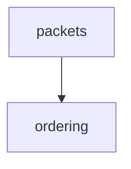

# The vault — lesson log + tutor tracking

Replaces the original `md-log` extension (which auto-mirrored the session into a linked markdown file). Here there is no extension: **you write the files yourself**, as you go.

## Where

Vault root: the folder in `$OBSIDIAN_VAULT_PATH` (written `<vault>` below). If the variable is unset, ask the learner once where their vault is and use that.

```
<vault>/
└── StudyVault/
    ├── dashboard.md              ← proficiency table + stats, stays small forever
    ├── concepts/
    │   └── <area>.md             ← per-area concept tracking
    ├── <Area>/                   ← one folder per subject area
    │   └── YYYY-MM-DD - topic.md ← the lesson log
    └── viz/                      ← images produced by the visualize skill
```

The `StudyVault/` name and the dashboard/concepts layout are **not arbitrary** — they are exactly what the `tutor` skill discovers and updates. Keeping them means every teaching session feeds the same tracking data `/tutor` drills from later. Do not rename them.

`<Area>` is a short subject name (`Networking`, `Linear Algebra`, `Rust`). The folder name and the concepts filename must match: area `Networking` → `StudyVault/Networking/` + `StudyVault/concepts/Networking.md`.

Paths contain spaces — quote them in every Bash/PowerShell call. If the vault folder is missing or its drive is not mounted, say so and ask where to write instead; don't silently fall back to another location.

## Phase 0 — opening the log

1. Check `<vault>/StudyVault/` exists; create it and `concepts/` if not.
2. Decide the area. Reuse an existing folder if the topic fits one; otherwise create a new area folder.
3. Create the lesson file `StudyVault/<Area>/YYYY-MM-DD - <topic>.md` with front matter:

```markdown
---
area: Networking
date: 2026-08-25
goal: (filled in after Phase 1b)
---

# <Topic>

```

4. Create `concepts/<Area>.md` from the template below if missing, and `dashboard.md` if missing.

## Mirroring the lesson

After each teaching turn, **append what you just said** to the lesson file — verbatim prose, LaTeX, mermaid blocks, image embeds. Not a summary: the log's value is that it is the lesson, re-readable months later. Append per turn, never batched at the end.

Structure it as you go:

- `## Plan` — the prose approach + the mermaid dependency map from Phase 2.
- `## Node 1 — <name>` … one section per node, containing the motivate / establish / connect text.
- Quiz checks go in as a small block: the question, their answer, ✓/✗, and the explanation.
- `## Still shaky` — the Phase 4 closing note.

Obsidian renders LaTeX and mermaid natively, so write both directly:

````markdown

````

Images from the `visualize` skill are embedded with a wikilink and a width — Obsidian resolves them by filename from anywhere in the vault:

```markdown
![[viz-tcp-stack-1756137600.svg|500]]
```

## Concept tracking (the `/tutor` integration)

**Every graded quiz answer** — probe questions in Phase 1a and quiz-checks in Phase 3 alike — updates `concepts/<Area>.md`. This is the whole point of the integration: `teach` fills the tracker, `/tutor` drills from it later.

Template:

```markdown
# <Area> — Concept Tracker

| Concept | Attempts | Correct | Last Tested | Status |
|---------|----------|---------|-------------|--------|

### Error Notes

```

Update rules (identical to the `tutor` skill's, so both write compatible files):

- **New concept** → add a row. If they got it wrong, also add an error note.
- **Existing 🔴 answered correctly** → increment attempts and correct, flip status to 🟢, **keep the old error note** (it's learning history).
- **Existing 🟢 answered wrong again** → increment attempts, flip back to 🔴, update the error note.

Error note format:

```markdown
**concept name**
- Confusion: what they mixed up (quote the wrong part of what they said — that's the diagnostic)
- Key point: the correct understanding
```

Name concepts at the **node** grain — one concept per node of the dependency graph, phrased as the thing understood ("why TCP needs sequence numbers"), not as the question asked.

## Dashboard

Recalculate at the end of a session (Phase 4) from the concept files — sum attempts and correct across every concept in an area.

```markdown
# Learning Dashboard

> Concept-based metacognition tracking. See linked files for details.

---

## Proficiency by Area

| Area | Correct | Wrong | Struggle | Level | Details |
|------|---------|-------|----------|-------|---------|
| Networking | 0 | 0 | - | ⬜ Unmeasured | [[concepts/Networking]] |
| **Total** | **0** | **0** | **-** | ⬜ Unmeasured | |

Struggle = Wrong / (Correct + Wrong) — the share of attempts that needed a correction before landing, not a success score. Lower is better.

> 🟦 Mastered (0-10%) · 🟩 Good (11-30%) · 🟨 Fair (31-60%) · 🟥 Weak (61-100%) · ⬜ Unmeasured

---

## Stats

- **Total Questions**: 0
- **Cumulative Struggle**: -
- **Unresolved Concepts**: 0
- **Resolved Concepts**: 0
- **Most Struggled Area**: -
- **Least Struggled Area**: -
```

The dashboard holds aggregated numbers only — no session logs, no per-question detail. It must stay small forever.

## Handing off to /tutor

`/tutor` discovers the vault by globbing `**/StudyVault/` from the **current working directory**. So it only finds this one when run from inside `<vault>` (or a parent of it). When you mention `/tutor` at the end of a session, mention that too.
