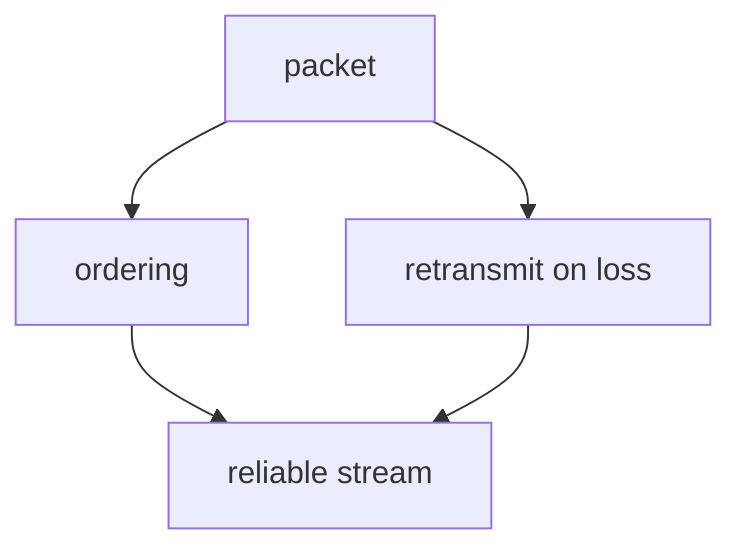

# Visualize

A picture earns its place only when it shows something words can't — shape, structure, direction, relationship, geometry. This skill produces ONE such picture, guarantees it is **correct**, and drops it into the lesson so it renders inline in the Obsidian log.

You are the **creative director**: you decide the exact idea and distill it to its fewest carrying elements.

## When to visualize (and when not to)

The `teach` system builds a **dependency graph in the learner's head** — unconditional truths at the root, derived facts hanging off them. A visual is powerful exactly when it makes that structure (or a geometry) visible. Reach for one when:

- The idea is a **structure or relationship**: dependencies, a system with parts and arrows, a flow/pipeline, a sequence of exchanges, a state machine, a tree/hierarchy, a comparison, a containment (what's inside vs outside).
- The idea is **spatial or geometric**: coordinate geometry, a number line, vectors, a function's shape, a physical arrangement.

Do NOT visualize when prose or a single equation already carries it. A decorative diagram that just restates the sentence next to it adds noise and a chance to be wrong. When in doubt, don't — a missing visual is cheaper than a false one.

## Two paths

The original system dispatched a `mermaid-maker` or `svg-maker` subagent that rendered a PNG and *looked at it* before returning. Claude Code doesn't need the rendering pipeline — Obsidian renders mermaid natively, and SVG embeds directly — but it also doesn't get that free verification. So verification becomes an explicit step you own (see below).

### Path A — mermaid (default)

For anything **nodes-and-edges**: dependency graphs, flowcharts, sequence/state/ER/class diagrams, trees, mindmaps, timelines. This fits the dependency-graph pedagogy directly, so it's the default.

Write the mermaid block **straight into the lesson file and into your chat reply**. No file, no subagent:

````markdown

````

Obsidian renders it natively; the terminal shows the source, which is fine.

### Path B — SVG

For **positions-and-shapes**: exact coordinates, geometry figures, number lines, vectors, plots, custom layouts that Mermaid's auto-layout can't express.

Write the SVG by hand (or with a diagram skill if you have one), then save it into `<vault>/StudyVault/viz/viz-<slug>-<unix-timestamp>.svg` and embed it by filename:

```markdown
![[viz-triangle-similarity-1756137600.svg|500]]
```

Unique timestamped filenames keep Obsidian's by-filename embed resolution unambiguous.

## One idea, fewest elements

The most common failure is **cramming** — every extra label makes the picture harder to read AND harder to lay out correctly. Before drawing, prune to the fewest elements that carry the idea, and for each ask: *"if I delete this, is the idea still clear?"* If yes, delete it.

If you're about to draw more than ~7 nodes, stop and simplify. A diagram of 4 nodes that each pull weight beats one of 12 that fight for space.

Be concrete about what the picture must show, not vague about the topic:

- BAD: "a diagram about how TCP works"
- GOOD: "`graph TD`: node `packet` at top; arrows down to `ordering` and `retransmit on loss`; both arrows down into `reliable stream`. No title. Shows that reliability is built FROM packets, not alongside them."

## Verify before you embed

Nothing renders the picture back to you here, so **correctness is entirely on you**. Before the block goes in the lesson, check it deliberately:

- **Every arrow points the right way.** Is each dependency actually true — does A really derive from B, or did you draw it backwards? A wrong edge is worse than no diagram: it plants a false connection in exactly the graph you're trying to build correctly.
- **Every label is correct and unambiguous**, and short — a term or short phrase, never a sentence. Long labels wreck mermaid layout.
- **The geometry is derived, not eyeballed** (SVG path): re-do the arithmetic for coordinates, angles, and proportions rather than guessing them.
- **Mermaid syntax is valid.** Watch the usual breakers: parentheses, quotes, or `-` inside node labels — wrap the label in `["..."]`. Reserved words like `end` need quoting. LaTeX does not work inside mermaid labels.
- **Would the learner read the intended idea from this picture alone?** If not, it's not carrying its weight.

If you can't make a correct, sensible picture of the idea, say so and skip the visual — don't ship a diagram you're unsure of.

## Then let it carry the idea

Introduce the visual in a sentence, then stop — don't narrate every element back in prose. The point of the picture is that it says what prose couldn't.

---

*Ported from [amosblomqvist/learn](https://github.com/amosblomqvist/learn).*
